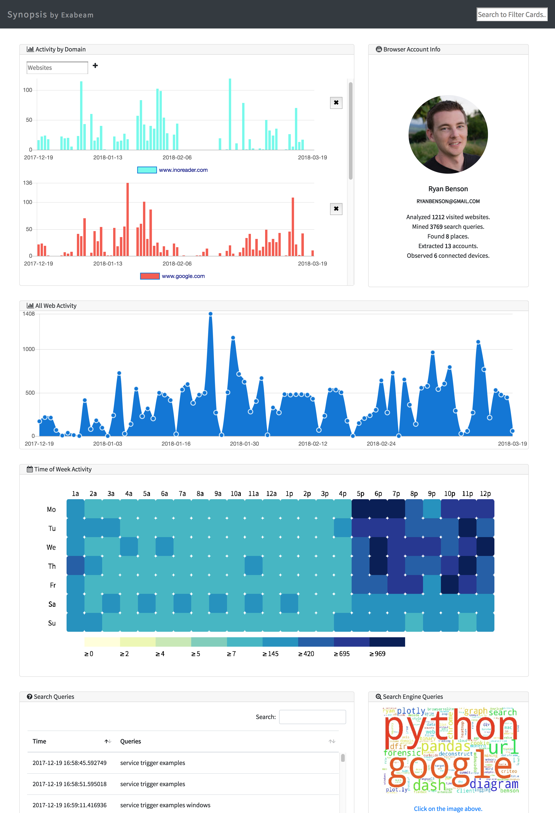

# Synopsis

Synopsis is a tool to aid analysts reviewing browser history files by providing
a high-level “synopsis” of key information. Many questions are common across
different types of investigations, and Synopsis aims to help investigators get
answers quickly. This tool provides a dashboard-type view that can be used to
assess whether the browsing history from the device in question is relevant to
the case at hand.



Synopsis extracts the following types of information:
-	search engine queries
-	discovered accounts on websites
-	autofill data (information typed into web forms)
-	historical geolocation
-	activity per domain
-	overall activity trends based on time and day of week

Each of the above items is displayed in one or more “cards” in a dashboard.
Synopsis also provides search functionality, so investigators can filter down
the collected data to terms of particular interest for their investigation.

Synopsis is built using open source technologies, including Python and several
Python libraries, Chart.js, and more. No code from any Exabeam products is used
in Synopsis.


## Install

```
git clone git://github.com/ExabeamLabs/Synopsis
cd Synopsis
pip install -r requirements.txt
```

## Usage

Run the `synopsis.py` Python script against the browser profile you want to
investigate. At this time, only Chrome is supported. If you are running this
script against your local Chrome profile, please make sure that Chrome is not
running.

```
python2.7 synopsis.py <path to Chrome profile>
```

This will generate `synopsis_YYYY-MM-DDTHH-MM-SS.json`. In the `web` sub-directory,
there is an `index.html` file. Open `web\index.html` in the web browser
of your choice. In the 'File Upload' pane that appears, click 'Choose File' and select
the generated Synopsis JSON file to review the results (the page may take a while to
load, depending on the size of the browser profile).

## Contribute

PRs accepted.

## License

Apache License 2.0
